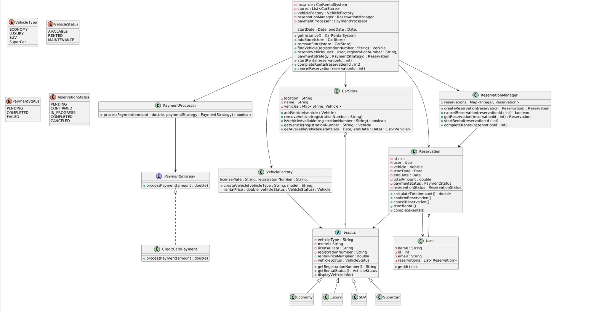

# Car Rental System (Low Level Design - Java)



## Overview
The system simulates a real-world car rental workflow including:

* Managing multiple car stores
* Adding and removing vehicles
* Creating and managing reservations
* Handling vehicle rentals
* Processing payments using strategy pattern
* Managing reservations lifecycle

The design focuses heavily on **SOLID principles**, **design patterns**, and **clean separation of responsibilities**, making it suitable for **Low Level Design (LLD) interviews** and **software architecture practice**.

---

# System Components

### Core Entities

| Component                           | Responsibility                           |
| ----------------------------------- | ---------------------------------------- |
| `Vehicle`                           | Abstract class representing a vehicle    |
| `Economy / Luxury / SUV / SuperCar` | Specific vehicle types                   |
| `CarStore`                          | Manages vehicles available at a location |
| `User`                              | Represents a customer                    |
| `Reservation`                       | Handles booking lifecycle                |
| `ReservationManager`                | Central reservation storage              |
| `CarRentalSystem`                   | Main system orchestrator (Singleton)     |

### Supporting Components

| Component           | Purpose                         |
| ------------------- | ------------------------------- |
| `VehicleFactory`    | Creates vehicle objects         |
| `PaymentStrategy`   | Payment abstraction             |
| `CreditCardPayment` | Concrete payment implementation |
| `PaymentProcessor`  | Executes payment using strategy |

---

# Design Patterns Used

### Singleton Pattern

Used in:

```
CarRentalSystem
```

Ensures only **one instance of the system** exists.

---

### Factory Pattern

Used in:

```
VehicleFactory
```

Creates different vehicle types:

* Economy
* Luxury
* SUV
* SuperCar

This prevents object creation logic from spreading across the system.

---

### Strategy Pattern

Used in payment processing:

```
PaymentStrategy
    |
    |---- CreditCardPayment
```

Allows adding multiple payment methods easily:

Future examples:

* PayPalPayment
* UpiPayment
* DebitCardPayment

---

# SOLID Principles Applied

## 1. Single Responsibility Principle (SRP)

**Definition**

> A class should have only one reason to change.

### Implementation in the System

Each class is responsible for a **single functionality**.

| Class                | Responsibility             |
| -------------------- | -------------------------- |
| `Vehicle`            | Vehicle data               |
| `CarStore`           | Store vehicle management   |
| `Reservation`        | Reservation lifecycle      |
| `ReservationManager` | Manage reservation storage |
| `PaymentProcessor`   | Payment execution          |
| `VehicleFactory`     | Vehicle creation           |
| `CarRentalSystem`    | System orchestration       |

Example:

```java
class PaymentProcessor {
    public boolean processPayment(double amount, PaymentStrategy paymentStrategy)
}
```

Only responsible for **processing payments**.

---

## 2. Open Closed Principle (OCP)

**Definition**

> Software entities should be **open for extension but closed for modification**.

### Implementation

The system allows adding new functionality **without modifying existing classes**.

Example:

Adding a new payment method:

```java
class UpiPayment implements PaymentStrategy {
    public void processPayment(double amount) {
        System.out.println("Processing UPI payment");
    }
}
```

No change required in:

```
PaymentProcessor
CarRentalSystem
Reservation
```

---

## 3. Liskov Substitution Principle (LSP)

**Definition**

> Subtypes must be replaceable with their base types.

### Implementation

Vehicle subclasses extend `Vehicle` and behave consistently.

```
Vehicle
   |
   |--- Economy
   |--- Luxury
   |--- SUV
   |--- SuperCar
```

Example:

```java
Vehicle vehicle = new SUV(...);
```

Works anywhere a `Vehicle` is expected.

---

## 4. Interface Segregation Principle (ISP)

**Definition**

> Clients should not be forced to depend on methods they do not use.

### Implementation

Instead of a large payment interface, the system uses:

```
PaymentStrategy
```

Which only contains:

```java
void processPayment(double amount)
```

Concrete implementations only implement what they need.

---

## 5. Dependency Inversion Principle (DIP)

**Definition**

> High-level modules should not depend on low-level modules. Both should depend on abstractions.

### Implementation

`CarRentalSystem` does **not depend on concrete payment classes**.

Instead it depends on:

```
PaymentStrategy (abstraction)
```

Example:

```java
Reservation reserveVehicle(
    User user,
    String registrationNumber,
    Date startDate,
    Date endDate,
    PaymentStrategy paymentStrategy
)
```

This allows the system to support multiple payment methods without modifying core logic.

---

# Reservation Lifecycle

```
PENDING
   |
   v
CONFIRMED
   |
   v
IN_PROGRESS
   |
   v
COMPLETED
```

Cancellation is allowed from:

```
PENDING
CONFIRMED
```

---
