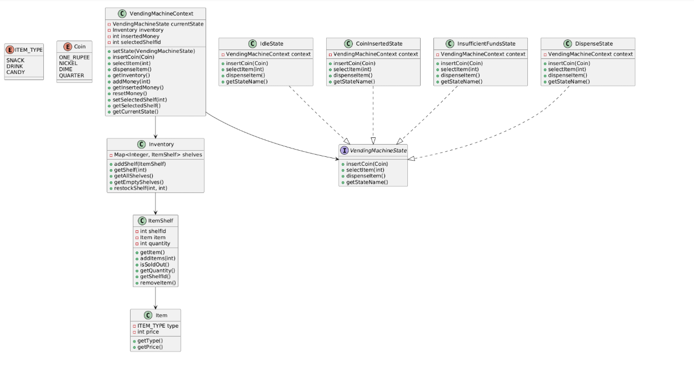

# Vending Machine Simulation in Java

This project demonstrates a **Vending Machine** implementation in Java using the **State Design Pattern** and other object-oriented design best practices.



---

## Key Features

- Supports multiple item types (`SNACK`, `DRINK`, `CANDY`).
- Handles coin insertion (`ONE_RUPEE`, `NICKEL`, `DIME`, `QUARTER`).
- Implements inventory management with shelves and restocking.
- Proper handling of sold-out items, insufficient funds, and dispensing.
- Designed for easy testing with repeatable setups.

---

## Design Patterns and Practices Used

### 1. State Design Pattern
- **Where:** `VendingMachineContext` + `VendingMachineState` interface + concrete state classes (`IdleState`, `CoinInsertedState`, `InsufficientFundsState`, `DispenseState`).
- **How:**
  - `VendingMachineContext` maintains a reference to the current state.
  - Each state class implements `insertCoin`, `selectItem`, and `dispenseItem`.
  - State transitions are handled via `context.setState(new SomeState(context))`.
- **Benefit:**
  - Encapsulates state-specific behavior.
  - Avoids large conditional statements (`if(currentState == ...)`) for handling events.
  - Makes it easier to add new states (e.g., `MaintenanceState`) without modifying the context.

### 2. Encapsulation & Information Hiding
- **Where:** Fields in classes are mostly `private` or `final` (`Item`, `ItemShelf`, `Inventory`, `VendingMachineContext`).
- **Benefit:** Internal state cannot be modified directly from outside, promoting data integrity.

### 3. Enum Usage
- **Where:** `ITEM_TYPE` and `Coin`.
- **Practice:** Strongly typed constants; `Coin` enum associates a value with each coin.
- **Benefit:** Avoids magic numbers, improves readability and maintainability.

### 4. Composition over Inheritance
- **Where:** `Inventory` contains `Map<Integer, ItemShelf>`, `ItemShelf` contains `Item`.
- **Benefit:** Promotes modular design and flexibility without unnecessary inheritance.

### 5. Single Responsibility Principle (SRP)
- **Observation:** Each class has a clear responsibility:
  - `Item` → represents a product.
  - `ItemShelf` → manages a shelf and quantity.
  - `Inventory` → manages collection of shelves.
  - `VendingMachineContext` → handles state and money.
  - State classes → define behavior depending on the current machine state.
- **Benefit:** Easier maintenance and testing.

### 6. Defensive Programming
- **Where:** `ItemShelf.removeItem()` and `Inventory.getShelf()`.
- **Benefit:** Prevents invalid operations and signals problems early (fail-fast).

### 7. Use of Collections
- **Where:** `Map` for shelves, `List` for returning all or empty shelves.
- **Benefit:** Efficient access and manipulation of inventory.

### 8. Separation of Concerns
- **Where:** State logic is separate from inventory management.
- **Benefit:** Cleaner design, easier testing and modification.

### 9. Exception Handling
- **Where:** `RuntimeException` in `ItemShelf` and `Inventory`.
- **Observation:** Could be improved with custom exceptions like `ShelfEmptyException`.

### 10. Testable Design
- **Where:** `Main.createFreshVM()` creates isolated vending machine instances.
- **Benefit:** Enables repeatable test scenarios, avoids global state issues.
- **Pattern Used:** Test Fixture / Factory method.

---

## Running the Project

1. Clone the repository:

```bash
git clone https://github.com/your-username/vending-machine.git
cd vending-machine